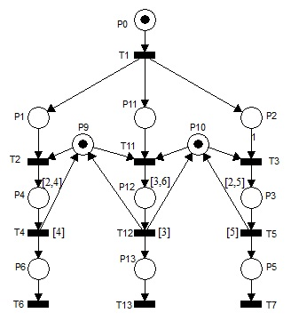
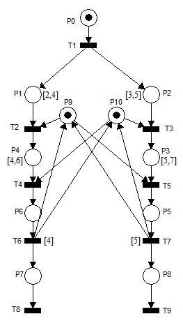
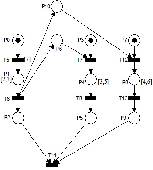

# Exerciții laborator 3 – 2025
Acest laborator are ca scop familiarizarea cu conceptele de bază ale programării concurente în Java, 
inclusiv utilizarea firelor de execuție, a excluderii mutuale, a mecanismului wait/notify și a mecanismului
join. De asemenea, se va lucra cu rețele Petri temporizate pentru a modela aplicații concurente.

Se cere implementarea în Java SE a următoarelor aplicații descrise prin rețele Petri temporizate.

### Convenții de implementare
Întârzierile de pe locațiile specificate corespund activităților care vor fi implementate folosind secvențe
de cod de forma:
```java
int k = ...; // random number within the specified interval
for (int i = 0; i < k * 100000; i++) {
    i++;
    i--;
}
```

Tranzițiile temporizate reprezintă întârzieri pure (care nu încarcă CPU-ul) și vor fi implementate prin apelarea
metodei sleep() din clasa Thread. Aceasta va suspenda firul de execuție curent pentru un anumit interval de timp.
```java
Thread.sleep(x); // x is the delay in milliseconds
```

Pentru a calcula o unitate de timp se va folosi (să zicem 10ms) se va folosi următoarea secvență de cod:
```java
long startTime = System.currentTimeMillis();
for (long i = 0; i < 20_000_000; i++) {
    i++;
    i+-;
}
long endTime = System.currentTimeMillis();
```
Bucla *for* de mai sus va dura aproximativ 10ms (pe propriul PC). Determinați prin incercări succesive numărul de iterații 
necesare pentru a obține o unitate de timp de 10ms pentru propriile sisteme.

## Exercițiul 1
Se dă rețeaua Petri din figura de mai jos. Se va folosi excluderea mutuală pentru elementele de sincronizare reprezentate de locațiile P9 și P10.



## Exercițiul 2
Se dă rețeaua Petri din figura de mai jos. Se va folosi excluderea mutuală pentru elementele de sincronizare reprezentate de locațiile P9 și P10.
Există riscul ca rețeaua să intre interblocaj (*eng. deadlock*)? Dacă da, modificați rețeaua și implementarea astfel încât să nu mai existe interblocaj.



## Exercițiul 3
Se dă rețeaua Petri din figura de mai jos. Se va folosi excluderea mutuală pentru elementul de sincronizare reprezentat de locația P8.


## Exercițiul 4
Se dă rețeaua Petri din Figura 4.6. Se vor folosi metodele wait()/notify() pentru sincronizările T6-P6-T7 și T6-P10-T12.
Sincronizarea finală din T11 se va implementa cu metoda join().



## Exercițiul 5 - Cont bancar
Creați o clasă BankAccount care să gestioneze în siguranță depunerile și retragerile concurente. Mai multe fire de 
execuție ar trebui să opereze pe aceeași instanță a contului fără a cauza actualizări inconsistente ale soldului.

### Cerințe:
- Implementați metodele deposit(int amount) și withdraw(int amount) astfel încât acestea să fie sigure pentru execuția concurentă.
- Utilizați cuvântul cheie synchronized pentru a proteja soldul partajat.
- Creați un test în care mai multe fire de execuție efectuează depuneri și retrageri simultan, și apoi verificați dacă soldul final este corect.

##### Vezi începutul de implementare din pachetul edu.tucn.str.ex5

## Exercițiul 6 - Producție și consum
Creați o aplicație care simulează un sistem de producție și consum. Un fir de execuție va produce date, iar altul le va consuma.
Se va folosi o coadă pentru a stoca datele produse și un mecanism de sincronizare pentru a asigura că producătorul nu produce date 
(așteaptă) atunci când coada este plină și consumatorul nu consumă date (așteaptă) atunci când coada este goală.

##### Vezi începutul de implementare din pachetul edu.tucn.str.ex6

## Exercițiul 7 - Logger de fișiere sincronizat
Într-o aplicație multi-thread, mai multe thread-uri trebuie să înregistreze mesaje în același fișier. 
Fără o sincronizare adecvată, mesajele din jurnal ar putea fi amestecate sau corupte. Implementați un logger thread-safe 
care să asigure că fiecare intrare de jurnal este scrisă în fișier în mod atomic.

### Cerințe:
#### Clasa Logger:
- Creeați o clasă Logger care scrie mesajele de jurnal într-un fișier (de exemplu, app.log).
- Includeți o metodă writeLog(String message) care adaugă o intrare de jurnal cu o marcă temporală.
- Utilizați cuvântul cheie synchronized în metoda writeLog (sau un bloc sincronizat) pentru a te asigura că, la un moment dat, doar un singur thread poate scrie.

#### Multi-threading:
- Scrie un program de testare în care mai multe thread-uri execută sarcini și utilizează logger-ul pentru a scrie mesajele lor.
- Fiecare thread ar trebui să scrie mai multe mesaje de jurnal.

#### Rezultat așteptat:
- Fișierul app.log ar trebui să conțină mesaje de jurnal formatate corect, fără interferențe între ele.
- Fiecare intrare de jurnal trebuie să includă o timpul la care a avut loc înregistrarea și identificatorul thread-ului.
